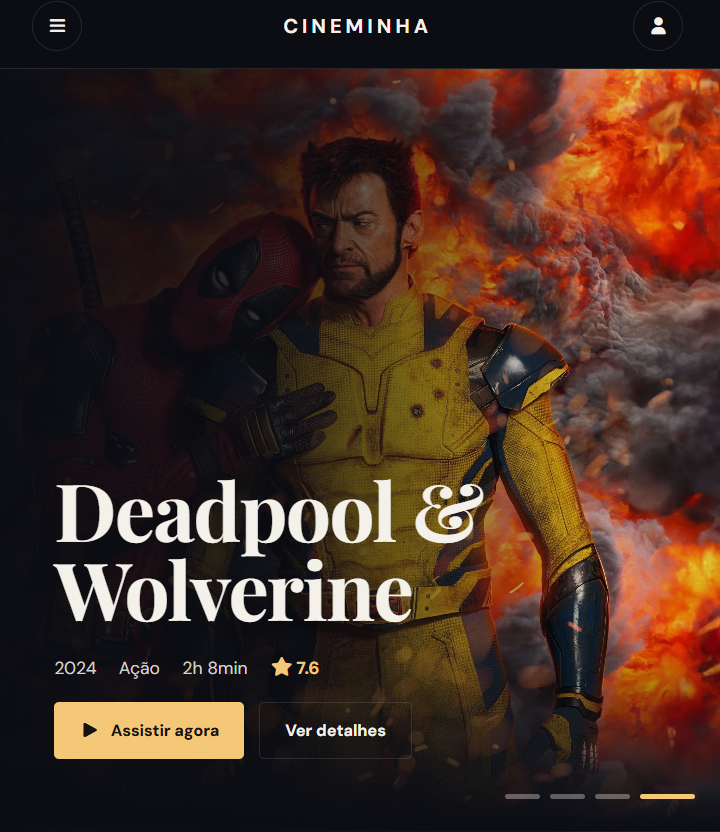
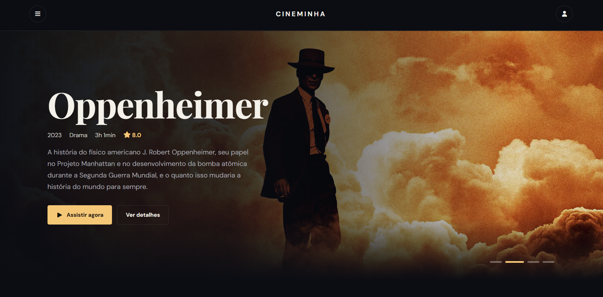
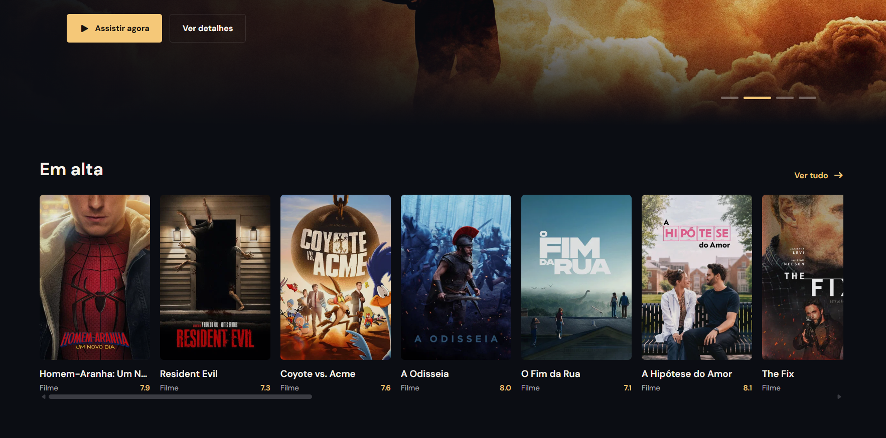

# CINEMINHA

Um catálogo de filmes com uma interface moderna e temática, desenvolvido com HTML, CSS e JavaScript, utilizando a API do TMDB para exibir informações sobre filmes.

## Preview

<p align="center">
  
  
  
</p>

## Tecnologias utilizadas

- **HTML5** — estrutura da aplicação.
- **CSS3** — estilização, layout e responsividade.
- **JavaScript** — interatividade e consumo da API.
- **TMDB API** — obtenção de informações e imagens dos filmes.
- **Font Awesome** — ícones da interface.

## Funcionalidades

- Exibição de filmes em destaque.
- Catálogo de filmes consumindo a API do TMDB.
- Exibição de pôsteres e imagens de fundo.
- Informações sobre título, avaliação, gênero, duração e sinopse.
- Cards de filmes com layout horizontal.
- Interface com tema escuro.
- Menu de navegação lateral.
- Descrições limitadas visualmente para manter a consistência do layout.

## Como executar o projeto

### 1. Clonar o repositório

```bash
git clone https://github.com/yjtank/cineminha.git
```

### 2. Acessar a pasta

```bash
cd cineminha
```

### 3. Configurar a API do TMDB

Este projeto utiliza a API do [The Movie Database (TMDB)](https://www.themoviedb.org/) para buscar informações e imagens dos filmes.

Para utilizar o projeto, você precisará criar uma conta no TMDB e obter sua própria chave de API.

#### Criando uma conta e obtendo a chave

1. Acesse [themoviedb.org](https://www.themoviedb.org/).
2. Crie uma conta ou faça login.
3. Acesse as configurações da sua conta.
4. Entre na seção **API**.
5. Solicite uma chave de API, caso ainda não tenha uma.
6. Copie sua chave de API v3.

Link direto: [Configurações da API do TMDB](https://www.themoviedb.org/settings/api).

#### Configurando a chave no projeto

Abra o arquivo JavaScript api.js responsável pelas requisições à API e localize a variável:

```javascript
const TMDB_API_KEY = "SUA_API_KEY";
```

Substitua `SUA_API_KEY` pela chave obtida no TMDB:

```javascript
const TMDB_API_KEY = "SUA_CHAVE_AQUI";
```

Salve o arquivo após inserir sua chave.

### 4. Executar

Após configurar a chave, abra o arquivo `index.html` no navegador.

Você também pode utilizar a extensão **Live Server** do Visual Studio Code para executar o projeto em um servidor local.

## Estrutura do projeto

```text
cineminha/
├── assets/
│   └── images/
│       ├── img1.png
│       ├── img2.png
│       └── img3.png
├── css/
│   └── style.css
├── js/
│   └── app.js
│   └── api.js
├── index.html
└── README.md
```

*Observação: a estrutura acima é ilustrativa. Os nomes das pastas e arquivos podem variar conforme a organização do projeto.*

## Créditos

Este projeto utiliza a API e as imagens disponibilizadas pelo [The Movie Database (TMDB)](https://www.themoviedb.org/).

Este produto utiliza a API do TMDB, mas não é endossado nem certificado pelo TMDB.

## Licença

Este projeto foi desenvolvido para fins de estudo e prática de desenvolvimento web.